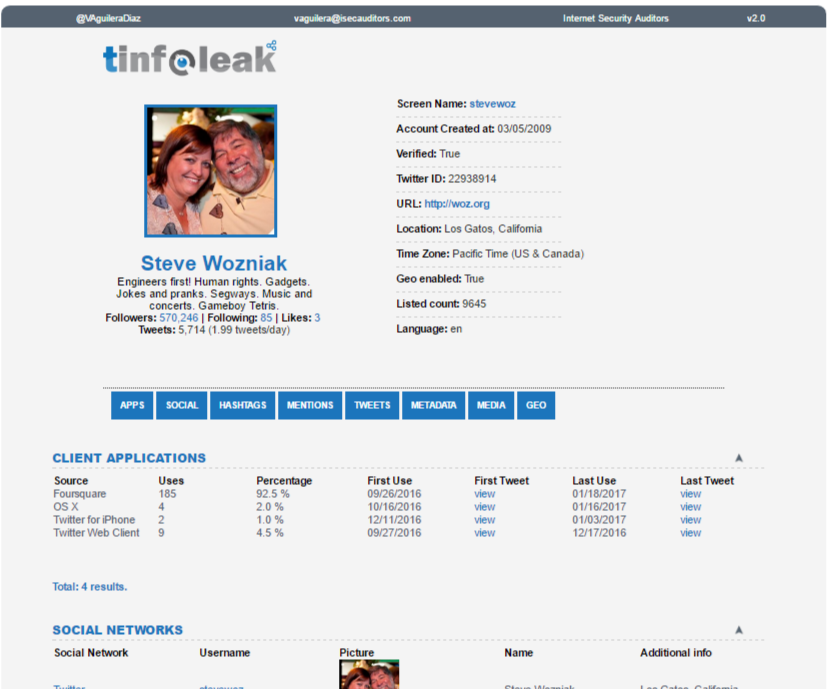

# 🗳️ Sentiment Analysis on Political Tweets for Privacy Study

This project explores the use of **sentiment analysis** to detect the political views of users who engage in political discourse on Twitter, particularly during the **2020 U.S. Presidential Election**. It highlights the **privacy risks**, **de-anonymization threats**, and potential **misuse of political sentiment**.

---

## 📘 Overview

- **Platform:** Twitter  
- **Focus:** Tweets mentioning **@realDonaldTrump** and **@JoeBiden**  
- **Analysis:** Sentiment polarity (positive, negative, neutral)  
- **Concerns:** Political echo chambers, bot amplification, and privacy violations  
- **Goal:** Reveal how political sentiment can lead to potential identity threats

---

## 📁 Dataset

- Tweets collected mentioning `@realDonaldTrump` between **Nov 2020 – May 2021**
- Initial tweets: **6,500**
- Final cleaned set (with location): **4,055 tweets**
- Follow-up analysis includes **@JoeBiden** mentions

---

## 🔍 Experiment

- Preprocessing steps included:
  - Removing hashtags, mentions, links
  - Filtering based on location and sentiment polarity
- Sentiment Distribution:
  - 🟥 Negative: 51%
  - 🟩 Positive: 15%
  - 🟨 Neutral: 35%

### 📍 Location-Based Insights

- **Negative Trump Sentiment**: California, Texas (high volume)
- **Positive Trump Sentiment**: Florida, New York (less precisely located)

---

### 🔄 Biden Sentiment Analysis

- Selected users with high Trump sentiment (positive/negative)
- Collected 50 tweets per user directed at **@JoeBiden**
- Identified **22 users** with strong dual polarity and high correlation
- 🧠 **Spearman correlation: 0.83**
---

## 🧠 Key Privacy Risks

1. **De-Anonymization**
2. **Social Engineering**
3. **Targeted Advertising**
4. **Cyberbullying**

Tool Highlight: **[Tinfoleak](https://tinfoleak.com/)**  


---

## 💡 Solutions

### 🆔 Separate Accounts
Use different aliases for personal and political content.

### 🌐 Use a VPN
Prevent location/IP-based targeting.

### 📜 Know Privacy Laws
Understand protections like **GDPR** and **CCPA** to reduce risks.

---

## 📝 Conclusion

> Our sentiment analysis reveals the **privacy vulnerabilities** of political tweeters. It also shows how sentiment data can infer **political allegiance**, placing users at risk of **profiling** or **manipulation**. As politics grows more digital, user privacy must become a priority.

---

## 🔗 References

- Conover et al., *Predicting the Political Alignment of Twitter Users*, IEEE, 2011
- Antypas et al., *Politics, Sentiment and Virality*, arXiv, 2022
- [Twitter Blog on Amplifiers](https://blog.twitter.com/en_us/a/2013/amplifiers-study)
- [Duo Labs: Amplification Bots](https://duo.com/labs/research/anatomy-of-twitter-bots-amplification-bots)

---

## 🗂️ Project Structure

```bash
📦sentiment-analysis-political-tweets/
 ┣ 📁 images/
 ┣ 📄 sentiment_analysis.ipynb
 ┣ 📄 README.md

